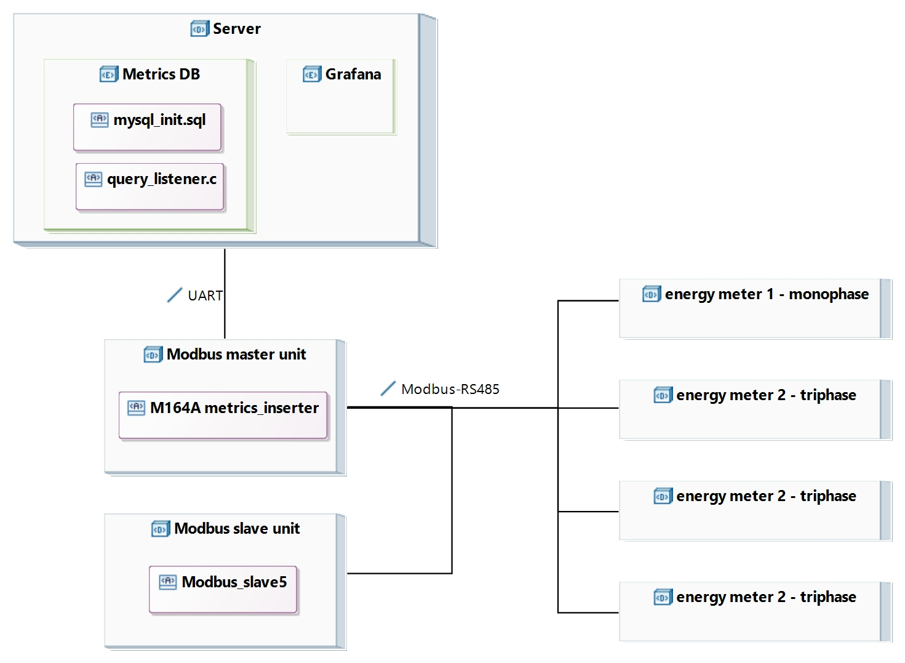
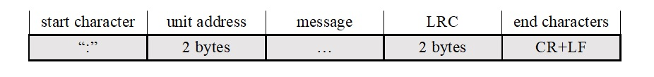
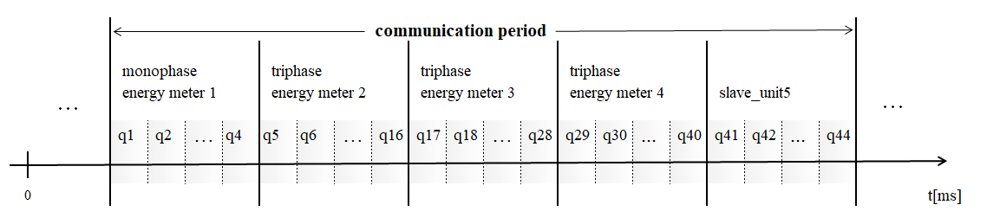
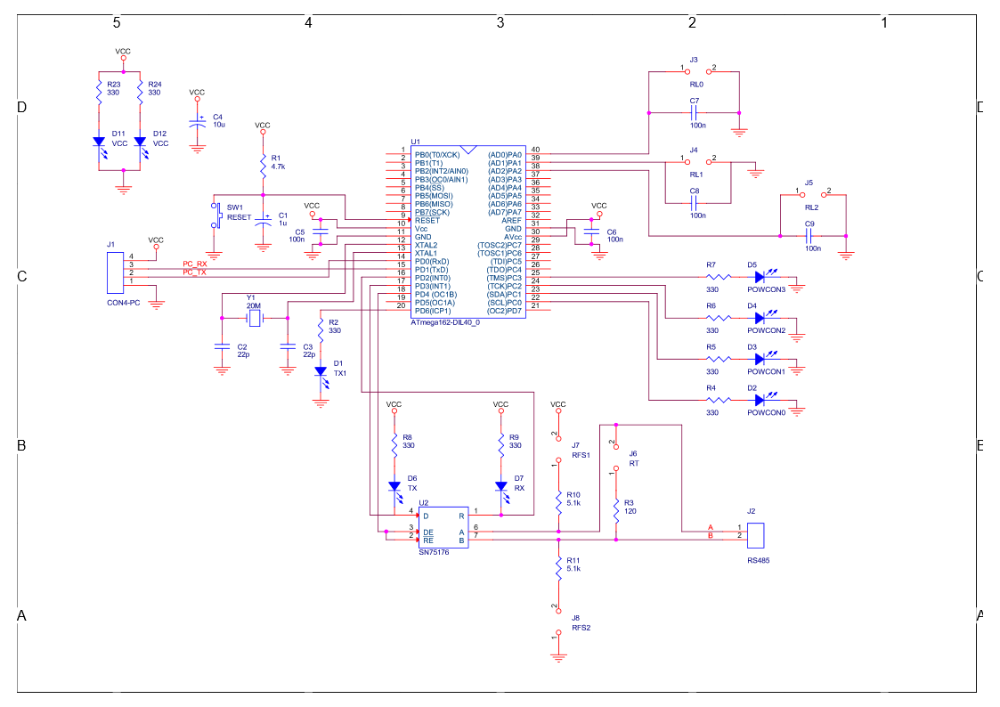
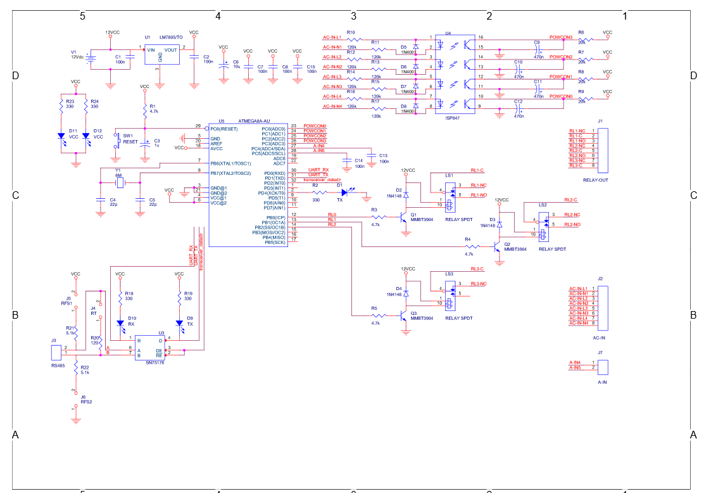
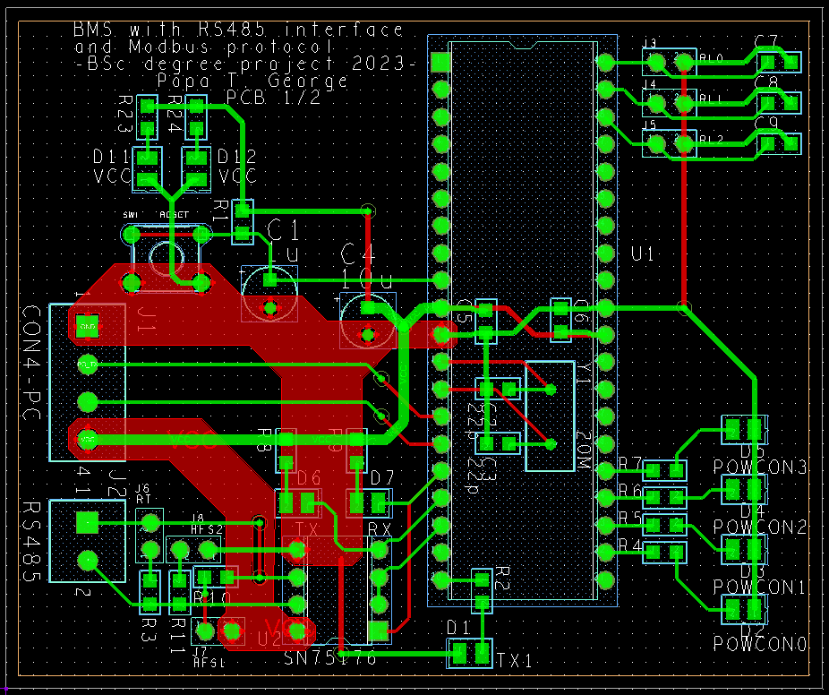
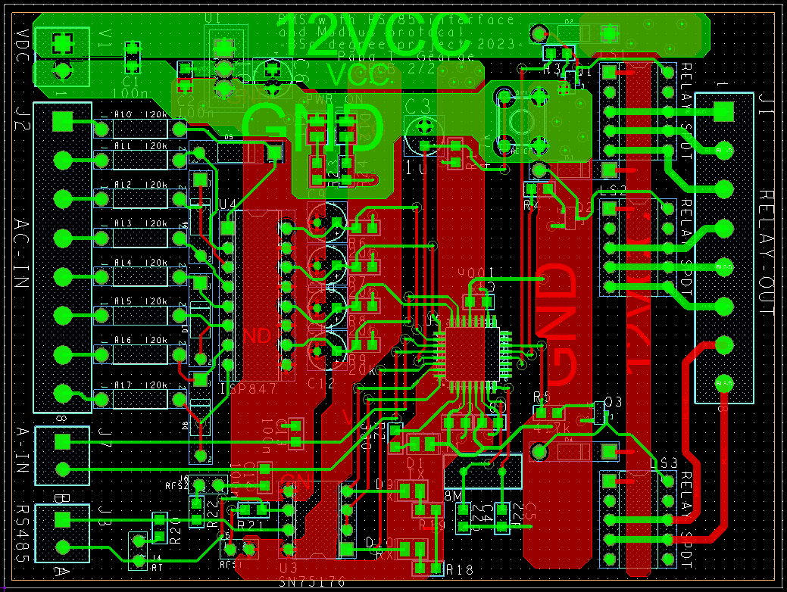
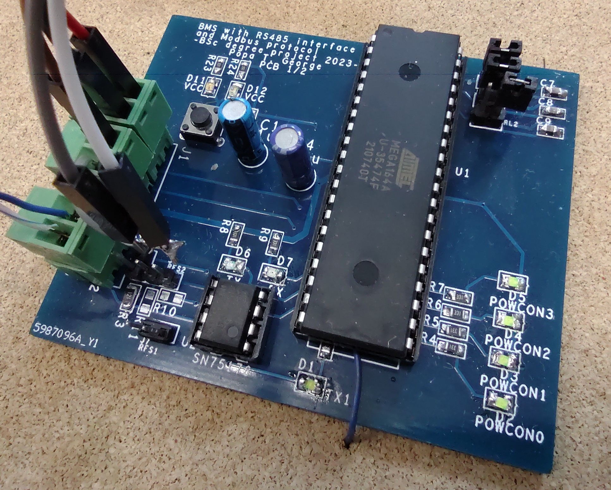
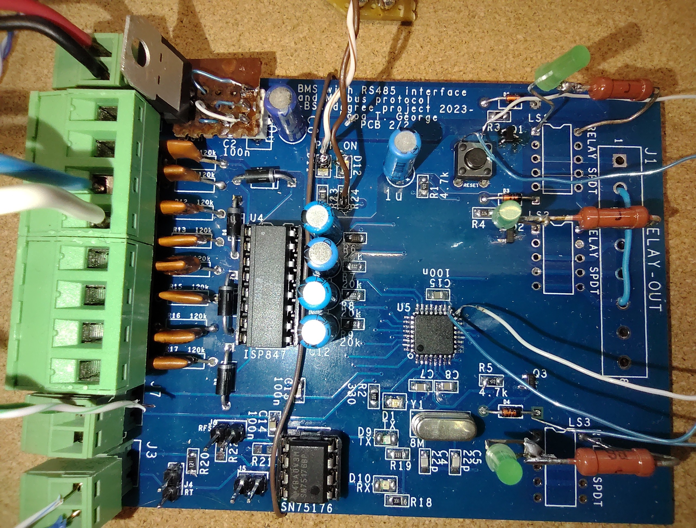

### Overview

A building management system was realized consisting mainly of a hardware and software implementation for a Modbus network. Separately, there is a server which displays the data.

The server and the Modbus master device represent the UI and are meant to be physically close to each other, while the rest of the devices should be placed further away, in an electrical panel. 
The 4 energy meters required to be queried are from LOVATO Electric, namely DMED121, 2 DMED301 products and DMG110.<!--ss-->

### Server

The server has the role of storing data and plotting it. For its first function, it uses a MySQL database created by a script and interfaced by a backend C program which listens for queries on UART port and passes them to the database. The communication with the Modbus master unit is simplex serial, with the server as the destination. To draw the real-time graphs, the server has Grafana installed and configured. With the aim of a low cost, low power and stable system, a Raspberry Pi 3 compatible single board computer was used, namely Banana Pi M2+ was used and Armbian was installed as OS.  
Inside the tables, data is organized as a fixed size queue, insertions are done via procedures which also delete the oldest record. The backend C program has to delete all rows and initialize the constant amount of rows with zeros.

### Modbus units

Two circuit boards were designed, each having a microcontroller as their main logic, connected on the bus with the help of the TTL-RS485 transceivers. Both use an Atmel AVR microcontroller, for their low cost, low power, simple, versatile, efficiency and ease of use. The actual used models are Atmega164A, 40-pin DIP variant, and Atmega8, 32-pin TQFP variant.

The master unit manages the slave units, by sending requests and keeping track of the valid response data, while the slave units provide the electrical data and module action:

- relay command
- mains electricity detection
- analog 0-5V measurement

A crucial part in the development of the 2 programs is processing and validating the Modbus ASCII packets.

The sequence of Modbus client queries, as represented below, is periodical. One requirement of this project was to insert in the database only the mean of 5 values, in order to lighten the load on the data base. For this, it was taken into consideration to insert only after 5 consecutive response values were averaged. If any of the queries fail, due to timeout or invalid packet, the query will be retried a maximum of 2 times. If all 3 attempts fail, the master unit will discard the current parameter set, meaning it will blank the members of the struct, and will move on to querying the next client in the sequence. The goal of this restriction is to have a better time resolution for the values.  
After the 5 successive, complete stores in the data structure, the mean is sent to the data base.

Both programs were developed using CodeVisionAVR, verified in simulations in AtmelStudio and SimulIDE and validated on actual hardware.  
The schematic and PCB design was done using Cadence Allegro.

|  |  |
| -------- | ------- |
|  |  |
|   |  |
| master device | custom slave device |

Extra video demos can be seen [here](https://drive.google.com/drive/folders/1yb0HvlTaTYRd0cgbd53ehsmiwsiStoLz?usp=drive_link).